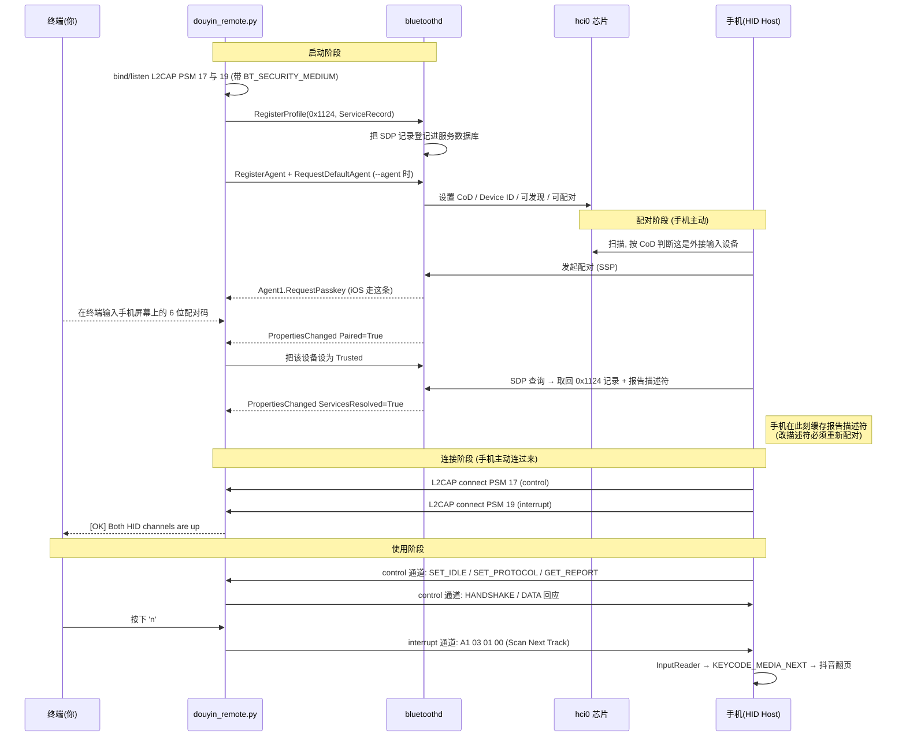

# btRemoteCtl —— 树莓派伪装蓝牙 HID 设备遥控手机刷视频

把树莓派变成一个**蓝牙 HID 输入设备**（键盘 / 鼠标 / 多媒体键，可选组合），手机把它当成一个真实的
外接键鼠，于是在树莓派终端敲一个键，就能让手机上的抖音翻到下一个视频。

不需要手机 root、不装 App、不开无障碍服务——因为在手机看来，这就是一个插在旁边的蓝牙键鼠。

```
    树莓派终端                        蓝牙链路                     手机
  ┌──────────────┐                                        ┌──────────────┐
  │  按下 'n'    │                                        │   抖音        │
  │      ↓       │   HID Input Report (L2CAP PSM 19)      │      ↑        │
  │ douyin_remote├───────────────────────────────────────>│ 系统输入栈    │
  │   .py        │   A1 03 01 00  (Scan Next Track)       │ (当成真实键鼠)│
  └──────────────┘                                        └──────────────┘
```

**实测状态**（详见 [§6 平台差异](#6-平台差异与共用配置)）：

| 平台 | 方案 | 状态 |
| --- | --- | --- |
| Android | 多媒体键（consumer control） | ✅ 已验证可控制抖音 |
| Android | 鼠标滚轮 | ✅ 真实蓝牙鼠标已验证 |
| iOS | `AC Home` 等系统级 usage | ✅ 已验证 |
| iOS | 鼠标拖拽 | ⚠️ 触摸注入已验证，翻页效果待确认 |
| iOS | 多媒体键 | ❌ 抖音 iOS 版不接（非本项目问题） |

---

## 目录

1. [快速开始](#1-快速开始)
2. [文件与模式](#2-文件与模式)
3. [蓝牙协议栈：这件事发生在哪一层](#3-蓝牙协议栈这件事发生在哪一层)
4. [完整时序：从配对到刷视频](#4-完整时序从配对到刷视频)
5. [报告描述符与报告格式](#5-报告描述符与报告格式)
6. [平台差异与共用配置](#6-平台差异与共用配置)
7. [按键表](#7-按键表)
8. [老化压力测试](#8-老化压力测试)
9. [八个坑（踩坑记录）](#9-八个坑踩坑记录)
10. [实现细节三则](#10-实现细节三则)
11. [排障](#11-排障)
12. [还原](#12-还原)
13. [已知限制](#13-已知限制)
14. [参考](#14-参考)

---

## 1. 快速开始

三条铁律，违反任何一条都会白折腾一轮：

1. **先启动 Python 脚本，再去手机上配对**——HID 的 SDP 记录是脚本注册的，脚本没运行时手机看不到 HID 服务。
2. **换过模式/描述符，必须在手机上删除配对再重新配对**——描述符是手机在配对时缓存的（[坑 4](#坑-4报告描述符是手机在配对时缓存的)）。
3. **`switch2hid.sh` 选的模式和 Python 的启动参数必须一致**——CoD 和描述符要说同一件事。
   脚本会打印配套命令，诊断（选项 3）也会检查这个一致性。

### Android

```bash
sudo ./switch2hid.sh    # 选 1 -> 选 2 (键盘+多媒体键)
sudo PYTHONIOENCODING=utf-8 python3 douyin_remote.py --keyboard-media
```

手机上删除旧配对 → 重新搜索并连接 → 终端出现两条通道 connected 之后，先按 `H`
（手机应回到桌面，证明通路已通），再按 `Enter` 刷视频。

### iOS

iOS 多两个前提：**必须已认证配对**（要输 6 位配对码），**鼠标必须先开 AssistiveTouch**
（设置 → 辅助功能 → 触控 → 辅助触控）。

```bash
sudo pkill -f bt-agent     # 自带代理和 bt-agent 会抢默认代理
sudo PYTHONIOENCODING=utf-8 python3 douyin_remote.py --mouse-only --agent
```

iPhone 上删除旧配对 → 点击树莓派 → 屏幕显示 6 位配对码 → **输到这个终端**回车。
连上后按 `x` 确认屏幕上有指针在动，按 `c` 定位指针，再按 `Enter`（滚轮）或 `u`（拖拽）。

### 两台共用

```bash
sudo ./switch2hid.sh    # 选 1 -> 选 1 (键鼠复合)
sudo PYTHONIOENCODING=utf-8 python3 douyin_remote.py --composite --agent
```

两台各自配对一次，运行时按 `o` 切换主操作方案（接 Android 切多媒体键，接 iPhone 切鼠标拖拽）。
注意**同时只能连一台**（[§13](#13-已知限制)）。

---

## 2. 文件与模式

| 文件 | 作用 |
| --- | --- |
| `switch2hid.sh` | 系统侧准备：改 CoD 和 Device ID、禁用 BlueZ `input` 插件、起配对代理、状态诊断、一键还原 |
| `douyin_remote.py` | 主程序：发布 SDP 记录、监听两条 L2CAP 通道、内置配对代理、把终端按键翻译成 HID 报告 |
| `douyin_stress.py` | 老化/压力测试：`import douyin_remote` 复用传输层，自动识别设备并按平台选方案，定时自动发键（[§8](#8-老化压力测试)） |

### 四种模式

描述符（Python 侧）、SDP 子类 `0x0202`、适配器 CoD（脚本侧）三者必须一致：

| 启动参数 | 模式 | 描述符 | CoD | 适用 |
| --- | --- | --- | --- | --- |
| `--composite` | 键盘+鼠标+多媒体 | 156 字节，Report ID 1/2/3 | `0x0005c0` | **两台共用，推荐** |
| `--keyboard-media` | 键盘+多媒体键 | 102 字节，Report ID 1/3 | `0x000540` | Android（对标罗技 K580） |
| `--mouse-only`（默认） | 纯鼠标 | 52 字节，**无 Report ID** | `0x000580` | iOS；兼容性最好 |
| `--keyboard-only` | 纯键盘 | 45 字节，Report ID 1 | `0x000540` | 项目最初那套，原样保留 |

另有一个配对开关：

| 参数 | 作用 |
| --- | --- |
| `--agent[=CAP]` | 在脚本内注册配对代理（`org.bluez.Agent1`），默认 capability `KeyboardDisplay`。iOS 必须用它（或 `bt-agent -c KeyboardOnly`）。启用时别再跑 bt-agent |

**为什么纯鼠标是默认**：经典蓝牙鼠标的描述符就是单 collection、不带 Report ID 的，主机侧这条路
走的人最多、最不容易出岔子。既然实测真鼠标能刷抖音，就把自己做得和它尽量一样，一次性排除
「报告 ID 对不上」和「复合描述符被主机拒绝」这两种可能。

**纯键盘模式的描述符与项目最初那份逐字节完全一致**，没有因为后来的改动而丢弃。

---

## 3. 蓝牙协议栈：这件事发生在哪一层

```
 ┌────────────────────────────────────────────────────────────┐
 │  应用层    douyin_remote.py  ← 把 'n' 翻译成 HID 报告       │
 ├────────────────────────────────────────────────────────────┤
 │  Profile   HID Profile (HIDP)   SDP                        │
 │            UUID 0x1124          服务发现, 告诉手机          │
 │            报告描述符           "我是什么设备, 报告长这样"   │
 ├────────────────────────────────────────────────────────────┤
 │  L2CAP     PSM 17 (control)  /  PSM 19 (interrupt)         │
 │            ← 本项目自己 bind/listen 这两个端口              │
 ├────────────────────────────────────────────────────────────┤
 │  HCI       bluetoothd / hciconfig / bluetoothctl           │
 │            设备类别 CoD、可发现性、配对(SSP)                │
 ├────────────────────────────────────────────────────────────┤
 │  Controller  树莓派板载蓝牙芯片 (hci0)                      │
 └────────────────────────────────────────────────────────────┘
```

四个关键概念：

- **CoD（Class of Device）**：广播包里的 3 字节设备类别。手机在**扫描阶段**就靠它决定显示什么图标、
  以及要不要按「外接输入设备」的流程处理。本项目用到三个值：
  - `0x000540` = Peripheral + Keyboard
  - `0x000580` = Peripheral + Pointing device
  - `0x0005c0` = Peripheral + Keyboard/Pointing 二合一
- **SDP（Service Discovery Protocol）**：配对后手机来问「你都有哪些服务」。我们答一条 `0x1124`
  （HumanInterfaceDevice）记录，其中最重要的是**报告描述符**——它定义了后续每一个字节的含义。
  另外还发布一条 PnP Information（`0x1200`）记录，即 `main.conf` 里的 `DeviceID`。
- **L2CAP PSM**：HID over BR/EDR 用两个**固定**端口：
  - **PSM 17（0x11）control**：主机下发 `SET_REPORT`/`GET_REPORT`/`SET_PROTOCOL` 等请求
  - **PSM 19（0x13）interrupt**：设备上报输入报告——**我们的数据走这条**
- **HIDP 传输头**：每个包第一个字节是 transaction header。`0xA1` = `(DATA << 4) | INPUT`，
  即「这是一份输入报告」，后面紧跟 Report ID（如果描述符声明了）和 payload。

---

## 4. 完整时序：从配对到刷视频



---

## 5. 报告描述符与报告格式

报告描述符（SDP 属性 `0x0206`）是整个协议的「数据结构定义」。代码里按 item 拆成带注释的列表
（`_KEYBOARD_BODY` / `_MOUSE_BODY` / `_CONSUMER_BODY` 组装成四种模式），拼接后就是 SDP 里那串 hex：

```
05 01     Usage Page (Generic Desktop)
09 06     Usage (Keyboard)
A1 01     Collection (Application)
85 01       Report ID (1)
05 07       Usage Page (Keyboard/Keypad)
19 E0       Usage Minimum (LeftControl)   ┐ 8 个修饰键
29 E7       Usage Maximum (Right GUI)     │ 每个 1 bit
75 01       Report Size (1)               │ → 合计 1 字节
95 08       Report Count (8)              ┘
81 02       Input (Data,Var,Abs)
...
```

### 各 Report ID 的报告格式

| Report ID | 设备 | payload | 报告格式（含 HIDP 头） |
| --- | --- | --- | --- |
| 1 | 键盘 | 8 字节 | `A1 01 <修饰键> <保留> <键码×6>` |
| 2 | 鼠标 | 4 字节 | `A1 02 <按键位> <X> <Y> <滚轮>` |
| 3 | 多媒体 | 2 字节 | `A1 03 <低8位> <高8位>` |
| 纯鼠标模式 | 鼠标 | 4 字节 | `A1 <按键位> <X> <Y> <滚轮>`（无 Report ID） |

**长度必须严格对齐**：描述符里写了 `Report Count (6) / Report Size (8)` 的 6 个键码槽，
报告就得发满 8 字节 payload，少一个字节主机就会解析错位（这个 off-by-one 曾真实存在于早期版本，
是靠一个自写的描述符解析器校验出来的：它走完所有 item，核对每个 Report ID 的 payload 位数
是否字节对齐、是否和代码实际发的包长度一致）。

鼠标位移是 8 位有符号数（`Logical Minimum (-127)` / `Maximum (127)`），代码里用 `dx & 0xFF`
转成补码，超过 127 的位移必须拆成多个报告连续发（`_move()` 干的就是这件事）。

### 多媒体键位图

2 字节 = 16 个 1bit 开关的小端位图，bit 顺序与描述符里 usage 的声明顺序一一对应：

| bit | usage | bit | usage |
| --- | --- | --- | --- |
| 0 | Scan Next Track（下一个视频） | 8 | AC Back（返回） |
| 1 | Scan Previous Track（上一个视频） | 9 | AC Forward |
| 2 | Stop | 10 | AC Search |
| 3 | Play/Pause（暂停播放） | 11 | AL Task Manager（多任务） |
| 4 | Mute | 12 | AC Show All Apps（多任务备选） |
| 5 | Volume Up | 13 | Fast Forward |
| 6 | Volume Down | 14 | Rewind |
| 7 | AC Home（Home 键） | 15 | Menu |

### 字节流示例

```
# 多媒体键「下一个视频」(Scan Next Track = bit0)
A1 03 01 00            按下
A1 03 00 00            松开

# 滚轮向下一格
A1 02 00 00 00 FF      Report ID 2, 无按键, X=0, Y=0, Wheel=-1

# 单击一次 (手机侧就是一次轻触; 纯鼠标模式无 Report ID)
A1 01 00 00 00         左键按下
A1 00 00 00 00         抬起

# 鼠标拖拽一次
A1 02 01 00 00 00      左键按下, 不移动
A1 02 01 00 BA 00      按住, Y 方向 -70  (0xBA = -70 的补码)
A1 02 01 00 BA 00      ...重复到累计 -700
A1 02 00 00 00 00      左键抬起
```

---

## 6. 平台差异与共用配置

同一份报告，两个平台的处理完全不同：

| 平台 | 有效 | 无效 |
| --- | --- | --- |
| Android | 多媒体键、鼠标滚轮/拖拽/点击 | 方向键、PageUp/PageDown |
| iOS | 鼠标拖拽/滚轮/点击（**需开 AssistiveTouch**）、`AC Home` 等系统级 usage | 多媒体键里的媒体命令、`AC Back`、方向键 |

原因见 [坑 3](#坑-3抖音不理方向键它认的是多媒体键)（Android）和
[坑 6](#坑-6ios-上同一份报告系统级有效应用级无效)（iOS）。

**交集是鼠标**——两边都能接受鼠标事件。两种共用做法：

### 做法一：`--composite`（推荐）

一份描述符里键盘（ID 1）、鼠标（ID 2）、多媒体键（ID 3）全都有，CoD 报键鼠二合一。
两台手机各自配对一次，**运行时按 `o` 键循环切换主操作方案**：

```
【当前主操作方案】多媒体键 (Android 首选)   (共 4 套, 按 'o' 循环切换)
```

四套依次是：多媒体键 → 鼠标滚轮 → 鼠标拖拽 → 键盘 F 键。`Enter` / `p` / `空格` 三个主操作
自动走当前方案，不用记不同按键，也不用重启脚本、不用重新配对。

代价：复合描述符带 Report ID，主机侧处理差异比单一设备大。真遇到某台手机不认，退回做法二。

### 做法二：`--mouse-only`（最保守）

纯鼠标、连 Report ID 都不用，和真实蓝牙鼠标几乎一样，兼容性最好。两边都用滚轮/拖拽/点击。
代价是 Android 上放弃了已验证可用的多媒体键，iOS 上也没有 Home 键。

---

## 7. 按键表

`Enter` / `p` / `空格` 三个主操作走**当前方案**，按 `o` 循环切换。帮助（`h`）里只列出当前模式
支持的键。

### 主操作

| 键 | 动作 | 说明 |
| --- | --- | --- |
| `Enter` / `n` | 下一个视频 | 当前方案 |
| `p` | 上一个视频 | 当前方案 |
| `空格` | 暂停 / 播放 | 多媒体键方案走 Play/Pause；鼠标方案走单击 |
| `o` | 切换主操作方案 | 多媒体键 → 滚轮 → 拖拽 → F 键 |

### 多媒体键（consumer control）

| 键 | 动作 | usage |
| --- | --- | --- |
| `H` | Home | AC Home（K580 的 F1）**兼诊断**：回桌面就说明通路是通的 |
| `B` | 返回 | AC Back（K580 的 F3） |
| `R` / `A` | 多任务 | AL Task Manager / AC Show All Apps（K580 的 F2，二选一试） |

### 鼠标

| 键 | 动作 | 说明 |
| --- | --- | --- |
| `c` | 指针定位到屏幕 50%/45% 处 | 拖拽/滚轮不灵先按这个 |
| `I` / `K` / `J` / `L` | 指针微调 上/下/左/右 | 大写；看着屏幕上的指针挪 |
| `w` / `s` | 滚轮 上/下 3 格 | |
| `u` / `d` | 拖拽 上滑/下滑 | 左键按下→移动→抬起 |
| `.` | 单击（轻触） | 抖音里 = 暂停/播放 |
| `,` | 双击 | 抖音里 = 点赞 |
| `;` | 右键 | Android 上相当于返回 |
| `/` | 长按 700ms | 抖音里 = 倍速/菜单 |

### 键盘

| 键 | 动作 | 说明 |
| --- | --- | --- |
| `1`..`9` `0` `-` `=` | F1..F12 | 备选假设：万一 K580 发的是普通 F 键码 |
| `k` / `j` | 方向键 上/下 | `0x52`/`0x51`（实测抖音不理） |
| `b` / `f` | PageUp / PageDown | `0x4B`/`0x4E`（实测抖音不理） |

### 诊断

| 键 | 动作 | 用途 |
| --- | --- | --- |
| `H` | Home | consumer 通路通不通，一按就知道（手机回桌面） |
| `t` | 连打 `abc` | 键盘通路通不通（在手机输入框里看） |
| `x` | 只移动指针 | 手机有没有把我们当鼠标（屏幕上有没有指针） |
| `h` / `q` | 帮助 / 退出 | |

**诊断顺序**：

1. 按 `H` → 手机回桌面 = consumer 通路已通，接着试 `Enter` / `p`
2. `H` 没反应但 `t` 能打出 `abc` = 键盘通、consumer 不通，试 `5`/`6`/`7`（普通 F 键码那套假设）
3. `t` 也打不出字 = 手机压根没采纳我们的报告，回到[坑 4](#坑-4报告描述符是手机在配对时缓存的)：手机侧删除配对重配
4. 鼠标不灵 = 先按 `x` 确认屏幕上真有指针，再按 `c` 定位

---

## 8. 老化压力测试

`douyin_stress.py` 用来长时间自动刷视频，验证链路稳定性。它 `import douyin_remote`
复用同一套传输层（不改动那个脚本），自己只负责「确认连接 → 识别设备 → 定时发键 → 统计」。

```bash
# 全自动: 模式看 CoD, 方案看设备类型, 每 3 秒一次, 跑到 Ctrl+C
sudo pkill -f douyin_remote.py     # 端口只能被一个进程占
sudo PYTHONIOENCODING=utf-8 python3 douyin_stress.py
```

### 两处自动识别

**模式自动识别**：从适配器当前 CoD 反推该用哪份描述符——CoD 正是 `switch2hid.sh` 设的，
两边必须一致（快速开始的第 3 条铁律）。所以系统侧准备做完之后，这里不用再手动指定：

| 适配器 CoD | 反推出的模式 |
| --- | --- |
| `0x000580` | `mouse` |
| `0x0005c0` | `composite` |
| `0x000540` | `kbdmedia`（和 `keyboard` 共用这个 CoD，取功能是超集的那个；配对时用的是 `--keyboard-only` 就加 `--mode keyboard`） |

**平台自动识别 + 方案自动分配**：连上之后从 BlueZ 读设备属性判断是 Android 还是 iOS，
因为两个平台能用的按键根本不是一套（[坑 3](#坑-3抖音不理方向键它认的是多媒体键) /
[坑 6](#坑-6ios-上同一份报告系统级有效应用级无效)）：

| 平台 | 自动选的方案 | 理由 |
| --- | --- | --- |
| Android | 多媒体键（Scan Next/Previous Track） | 实测有效；模式里没 consumer 就退滚轮 |
| iOS | 鼠标拖拽 | 抖音 iOS 不接媒体键，只有鼠标注入的真实触摸有用 |

识别依据按可靠性排序：

1. **`Modalias` 的厂商 ID**——最可靠，来自对端的 PnP 记录，`bluetooth:v004Cp…` 里 `0x004C` 就是 Apple
2. 设备名含 `iphone`/`ipad`/`ipod`/`macbook`
3. Apple 专有服务 UUID（ANCS/AMS/Continuity 等前缀）
4. 都不命中 → 按 Android 处理

> 光看设备名并不可靠——实测那台 iPhone 的名字叫 **Emoji**。所以厂商 ID 排在第一位。
> 识别不准时用 `--platform ios` / `--plan drag` 手动指定。

如果落到「iOS + 多媒体键」这种组合（比如 CoD 是纯键盘模式却连了 iPhone），脚本会明确警告
「这套大概率无效」，而不是让你对着不动的屏幕怀疑硬件。

### 常用参数

```bash
# 每 1.5 秒一次, 共 2000 次, 明细写 CSV
sudo PYTHONIOENCODING=utf-8 python3 douyin_stress.py --interval 1.5 --count 2000 --log /tmp/aging.csv

# 上下交替, 跑 8 小时, 间隔带 ±20% 抖动
sudo PYTHONIOENCODING=utf-8 python3 douyin_stress.py --direction alternate --duration 8h --jitter 0.2

# 手动指定一切
sudo PYTHONIOENCODING=utf-8 python3 douyin_stress.py --mode composite --platform ios --plan drag
```

| 参数 | 说明 |
| --- | --- |
| `--interval` | 间隔秒数（默认 3.0） |
| `--jitter` | 间隔随机抖动比例，`0.2` = ±20%（默认 0） |
| `--count` / `--duration` | 次数上限 / 时长上限（`90s`/`15m`/`8h`），0 = 不限 |
| `--direction` | `next` / `prev` / `alternate`（上下交替） |
| `--mode` / `--platform` / `--plan` | 三处自动识别的手动覆盖 |
| `--wait` | 等待连接/重连的超时（默认 120s） |
| `--settle` | 连上后先等几秒再开始（默认 3s） |
| `--report-every` | 每多少次打印一行统计（默认 10） |
| `--log FILE` | 每次结果追加写 CSV |
| `--verbose` | 显示底层每次发送的输出（默认只在出错时显示） |

### 行为要点

- **先确认连接再开始**：要求 **control 和 interrupt 两条通道都建立**才发第一个键
  （只有 control 时输入报告根本发不出去），否则等到 `--wait` 超时就退出，不做无意义的发送
- **鼠标方案会先定位指针**：滚轮事件派发给指针下方的 View，拖拽起点贴着屏幕底部还会被
  系统边缘手势吃掉（[坑 7](#坑-7拖拽起点贴着屏幕边缘--触发系统手势应用收不到)）。加 `--no-center` 可跳过
- **掉线自动等重连并计数**，不中断测试——这正是老化测试要观测的指标
- **失败判定**：底层方法自己 catch 了异常只打印，所以脚本会抓取输出里的 `[ERROR]`/`[WARN]`，
  再加一条「发完之后通道还在」，两者都过才算成功
- **Ctrl+C 出报告**：用 `GLib.unix_signal_add` 而不是裸 `signal`——`MainLoop.run()` 阻塞在 C 里，
  Python 的信号处理函数不一定能及时跑到

结束时打印总结：

```
==========================================================
 老化测试报告
==========================================================
  对端设备      : 48:4C:86:37:CC:62 / Redmi K60
  平台 / 方案   : android / 多媒体键 (Android 首选)
  方向          : next
  间隔          : 1.5s
  总时长        : 2h13m40s
  发送次数      : 5320
  成功 / 失败   : 5318 / 2  (失败率 0.04%)
  断连次数      : 1
  重连累计等待  : 12s
  单次发送耗时  : 平均 51.3ms / 最大 187.0ms
  错误分类:
         2 x  [ERROR] Send consumer key failed: [Errno 107] Transport endpoint is not connected
  CSV 明细      : /tmp/aging.csv
==========================================================
```

---

## 9. 八个坑（踩坑记录）

这一节是这个项目真正的价值所在——每个坑都记了「现象 → 为什么 → 怎么定位 → 怎么解」。
几乎每一个的现象都极具误导性。

### 坑 1：BlueZ 自带的 `input` 插件会把端口占掉

BlueZ 内置的 `input` 插件实现的是 HID **Host**（主机）角色——即「树莓派连一个蓝牙键盘」那个方向，
它会占用 L2CAP PSM 17/19。我们要做的是反方向的 **Device**（设备）角色，同样需要这两个端口。

**现象很有迷惑性**：手机能搜到、能配对、能完成服务发现，但 HID 会话永远建立不起来，脚本这边
一个回调都没有。

**解法**：让 `bluetoothd` 带 `-P input` 启动。用 systemd drop-in，不改发行版原始 unit：

```ini
# /etc/systemd/system/bluetooth.service.d/10-hid-noinput.conf
[Service]
ExecStart=
ExecStart=/usr/libexec/bluetooth/bluetoothd -P input
```

第一行空的 `ExecStart=` 是必须的——systemd 里 `ExecStart` 是累加型指令，不先清空就变成两条启动命令。
`bluetoothd` 的路径在 Bookworm 是 `/usr/libexec/bluetooth/`，旧版在 `/usr/lib/bluetooth/`，脚本自动探测。

### 坑 2：`RegisterProfile` 只发布 SDP 记录，不会替你监听端口

`org.bluez.ProfileManager1.RegisterProfile()` 返回成功，**不代表**有人在监听 HID 端口。对 `0x1124`
来说它只做了一件事：把你给的 `ServiceRecord` 登记到 SDP 数据库。

原因很简单：profile 选项里只能带**一个** PSM，而 HID 设备角色需要 control + interrupt **两条**通道，
这条 D-Bus 接口在设计上就表达不了。

**现象**：配对 ✓ → SDP 查询拿到 `0x1124` ✓ → 手机去连 PSM 17 → **没人 listen，连接被拒** →
HID 会话建立失败，`Profile1.NewConnection` 永远不会被回调。

**解法**：SDP 记录仍交给 `RegisterProfile` 发布，两条通道由脚本自己持有：

```python
srv = socket.socket(socket.AF_BLUETOOTH, socket.SOCK_SEQPACKET, socket.BTPROTO_L2CAP)
srv.bind((socket.BDADDR_ANY, psm))     # psm = 17 和 19
srv.listen(1)
```

绑定 PSM < 0x1000 需要 root，所以脚本必须 `sudo` 跑。代码里保留了 `NewConnection` 作为兜底路径
（万一某个 BlueZ 版本确实自己监听了，fd 也能收下用）。

> **启动顺序**：先 bind 端口，再注册 SDP。反过来的话，手机可能在端口还没就绪时就连过来。

### 坑 3：抖音不理方向键——它认的是「多媒体键」

链路完全打通、报告也确实发出去之后，仍然刷不动视频。原因在手机的**上层**。

先说无效的那条：Android 的 `InputReader` 把 HID 键盘方向键映射成 `KEYCODE_DPAD_DOWN`，走的是
**焦点导航**（D-pad navigation）那套派发逻辑。抖音的竖向 feed 是 `ViewPager2`/`RecyclerView`，
不处理这类按键事件，按了等于没按。PageUp/PageDown 同理。

定位靠的是**拿现成设备做对照实验**，两条实测：

**实测 A：真实蓝牙鼠标，滚滚轮可以刷抖音。** Android 把滚轮事件作为 `ACTION_SCROLL` 的
`MotionEvent` 派发给**指针下方**的 View，`RecyclerView`/`ViewPager2` 是处理它的。

**实测 B（关键）：罗技 K580 无线键盘的 F 行可以完整控制抖音**——
F1 = Home，F2 = 多任务，F3 = 返回，F5 = 上一个，F6 = 暂停/播放，F7 = 下一个。

实测 B 的解释是唯一的：**Android 本身没有「F1 → Home」这种映射**，但 HID consumer control 页里的
`AC Home (0x0223)` 恰恰就是 Android 标准映射到的 `KEYCODE_HOME`。所以 K580 的 F 行发的根本不是
普通 F 键码，而是 **consumer control（多媒体键）** 的 usage：

| K580 按键 | 实际发的 usage | Android 映射 |
| --- | --- | --- |
| F1 | AC Home `0x0223` | `KEYCODE_HOME` |
| F2 | AL Task Manager `0x01A2` / AC Show All Apps `0x029F` | 多任务 |
| F3 | AC Back `0x0224` | `KEYCODE_BACK` |
| F5 | Scan Previous Track `0x00B6` | `KEYCODE_MEDIA_PREVIOUS` |
| F6 | Play/Pause `0x00CD` | `KEYCODE_MEDIA_PLAY_PAUSE` |
| F7 | Scan Next Track `0x00B5` | `KEYCODE_MEDIA_NEXT` |

于是 Android 上的方案就是复现这套 consumer 码。`home` / `back` 还有额外的诊断价值：视频翻不翻页
得盯着屏幕判断，而按一下 Home 手机直接回桌面，**一眼就能确认通路通不通**。

> **一个此前的误判**：早先试多媒体键「无效」，那次其实是**无效实验**——当时手机用的是缓存里的
> 纯键盘描述符，Report ID 3 的报告会在手机的 HID 解析层被丢弃。多媒体键在那之前从未真正测过。
> 这是坑 4 的又一个受害者。

### 坑 4：报告描述符是手机在配对时缓存的

**现象最具误导性**：脚本这边每一条都打印 `sent`，手机上却毫无反应——因为
**「写进 socket 成功」和「手机采纳了这份报告」是两件事**。

手机在配对时通过 SDP 取回报告描述符并**缓存**下来（Android 存在 `bt_config.conf`，按 MAC 索引）。
如果设备原来是「纯键盘」，后来改成了「键盘+鼠标」，但手机侧没有真正删除配对，那么手机用的仍是
旧描述符：里面没有 Report ID 2，于是所有鼠标报告在手机的 HID 解析层就被丢弃了，而键盘报告
（Report ID 1）照常送达——正好解释了「键盘键能发但抖音不理，鼠标动作完全没反应」。

**怎么确认**，两条证据当时都命中了：

- 日志里 `Paired=True` 出现在两条通道**连上之后**，说明手机是拿旧绑定信息重连的，没走完整配对流程；
- control 通道只收到一条 `[RX control] 90 00`（**SET_IDLE**，给键盘设空闲率的请求），
  没有任何针对鼠标的动作；同时按 `x` 在手机屏幕上**始终看不到指针**。

两条合起来：手机的 HID host 是活的、在正常初始化设备，但它按**纯键盘**在初始化我们。

**解法**：只要改过描述符，就必须在**手机的蓝牙设置**里删除该设备再重新配对。只在树莓派侧
`bluetoothctl remove` 是不够的。

### 坑 5：iPhone 配不上——iOS 要求「已认证」的配对

**现象**：反复 `Connected=True` / `Connected=False`，**始终没有 `Paired=True`**，也没有任何
L2CAP 通道连上。

先看卡在哪一步：ACL 链路已经建起来了，但配对没完成就被断开。SDP 查询、HID 通道连接都发生在配对
**之后**，所以这跟描述符、CoD、L2CAP 端口统统无关——问题在 bonding 阶段。

**原因**：iOS 对 HID 设备要求已认证的配对（passkey entry，带 MITM 保护）。HID 是能注入按键的设备，
Apple 在这里不接受无认证的 Just Works。而脚本原来起的是：

```bash
bt-agent -c NoInputNoOutput > /dev/null 2>&1 &
```

两个问题叠在一起：`NoInputNoOutput` 协商出来就是 Just Works（无 MITM 保护）；而且它在**后台**运行、
输出全丢进 `/dev/null`——**即使 iOS 发来配对码请求，提示也被丢掉了，根本没人能应答**。
iOS 等超时就断开、重试，于是 `Connected` 反复跳。Android 对此宽松得多，Just Works 就能过。

**解法**：用能输配对码的前台代理。推荐脚本自带的（`--agent`，见坑 8），也可以用
`bt-agent -c KeyboardOnly`。

**坑中坑**：`bluez-tools` 的 `bt-agent` 只认 BlueZ 早期的四种 capability
（`DisplayOnly` / `DisplayYesNo` / `KeyboardOnly` / `NoInputNoOutput`），**没有 `KeyboardDisplay`**，
传给它会直接报错退出：

```
bt-agent: Invalid capability: KeyboardDisplay
```

而脚本在启动前台代理之前会先 `pkill` 掉后台那个——于是**一个配对代理都没注册**，现象和
「iOS 拒绝配对」一模一样，极容易误判。两个教训都修进脚本了：

- 选项 4 先跑 `bt-agent --help` **探测本机实际支持的 capability**，只列可用的，选了不支持的直接拦下；
- 后台代理不再把输出丢进 `/dev/null`，改成写 `/tmp/bt-agent.log`，启动后校验进程是否真的活着，
  没活着就把日志打出来。**代理静默死掉这件事，绝不能看不见。**

同时给 `main.conf` 加了 Device ID，BlueZ 会把它作为 PnP Information（`0x1200`）记录发布——
iOS 对 HID 的 SDP 记录比 Android 挑剔，缺 PnP 记录也可能配不上：

```
DeviceID = usb:v1D6Bp0246d0517
```

`1D6B` 是 Linux Foundation 的 USB VID，表明「我是个 Linux 设备」，不冒用别家厂商 ID。

> 要确认卡在哪一步，看 bluetoothd 的日志：`sudo journalctl -u bluetooth -f`，
> 配对失败会写明原因，比在应用层猜快得多。

### 坑 6：iOS 上同一份报告，「系统级」有效、「应用级」无效

iPhone 配对成功、HID 会话建立之后，实测结果很有意思：

| 按键 | usage | iOS 结果 |
| --- | --- | --- |
| `H` | AC Home `0x0223` | **有效**，回到桌面 |
| `Enter` / `p` | Scan Next / Previous Track | 无效 |
| `空格` | Play/Pause | 无效 |
| `B` | AC Back `0x0224` | 无效 |
| `R` / `A` | 任务管理 / 显示全部应用 | 无效 |

`H` 有效这件事信息量很大：**它证明 consumer 这条通路是完全正常的**——Report ID 3、2 字节位图、
bit 顺序全都对，报告确实被 iOS 解析并派发了。所以「其它键没反应」不是协议问题。

差别在派发的**去向**：

- `AC Home` 由 iOS **系统层**直接处理，所以有效；
- `Scan Next/Previous Track`、`Play/Pause` 是**应用级**媒体命令，iOS 路由给当前的 now-playing
  会话（`MPRemoteCommandCenter`）。抖音 iOS 版没有注册这些 remote command，没人接手；
- `AC Back`、任务管理这些在 iOS 上压根没有对应的系统概念。

**所以 iOS 上键盘这条路到此为止**，再怎么改描述符也没用。iOS 想刷视频只能走鼠标——鼠标拖拽在
iOS 上是真实的触摸事件。

但 iOS **默认不启用外接指针设备**，必须先打开：

```
设置 -> 辅助功能 -> 触控 -> 辅助触控 (AssistiveTouch)
```

不打开这个开关，鼠标报告发过去不会有任何反应（Android 不需要这一步）。

### 坑 7：拖拽起点贴着屏幕边缘 = 触发系统手势，应用收不到

iOS 开了 AssistiveTouch 之后，鼠标拖拽确实生效了，但结果不是翻到下一个视频，而是
**视频缩成小窗**——那正是 iOS 的「上滑回主屏 / 多任务」手势。

这个现象本身是好消息：**只有真实触摸事件才能触发系统手势**，说明触摸注入完全成功了。
问题只在于滑动的**起点**落在了屏幕底部边缘，被系统的边缘手势先截走了，抖音根本没收到这个事件。

根因在指针定位：相对鼠标不知道自己在哪，所以 `_home_pointer()` 先往左上角猛推顶到 `(0,0)`
（指针被边界夹住，推多了无副作用），再往目标位置挪。第二步原来用的是 `step=100` 的大步长——
**系统的指针加速会放大快速移动**，于是指针冲过了目标，被夹在屏幕底部。

```python
POINTER_STEP = 12           # 定位用小步长: 加速只放大快速移动, 小步慢移基本 1:1
POINTER_DELAY = 0.008
SWIPE_START_Y_FRAC = 0.45   # 起点取屏幕高度 45% 处, 刻意远离底部手势区
```

三处改动：

- 定位改成**小步慢移**，落点从「屏幕中间」改成纵向 45%，远离底部手势区；
- 定位一次要一秒多，所以加了 `homed` 标记**只在第一次滑动前定位**；每次滑完把指针挪回起点，
  免得连续滑动一路把指针推到边缘；
- 加了 `I` / `K` / `J` / `L` 手动微调指针——屏幕尺寸和指针加速都是估的，看着屏幕挪最可靠。

> **一般规律**：任何靠模拟指针拖拽代替手指滑动的方案，都要留意起点别落在系统手势区
> （iOS 的底部/侧边、Android 的手势导航边缘），否则事件会被系统层先吃掉。

### 坑 8：把命令用管道喂给 bluetoothctl，退格会变成字面量 `^H`

为了让 `bluetoothctl` 自动注册代理，一个看起来很聪明的写法是：

```bash
# 反面教材，不要这样写
{ echo "agent KeyboardDisplay"; echo "default-agent"; cat; } | bluetoothctl
```

先喂两条命令注册代理，再用 `cat` 把终端的后续输入转发进去。结果输配对码时是这样的：

```
Enter passkey: 52^H^H^H
Device: Emoji (FC:AA:81:92:73:57)
Enter passkey: Device: Emoji (FC:AA:81:92:73:57)
Enter passkey: ...
```

**退格没有被处理，而是作为字面量 `^H` 字节混进了配对码里**，码自然是错的，iOS 于是不断重试。

原因：这么一接，`bluetoothctl` 的 stdin 就是**管道而不是 TTY**，它的 readline 行编辑随之失效；
终端那侧也没在做 erase 处理，退格字节就被原样转发了。**只要把交互式程序的 stdin 接成管道，
它的行编辑就没了**——这个坑不限于 bluetoothctl。

**修法一（推荐）：配对代理直接做进 Python 脚本。** 用 BlueZ 的 `org.bluez.Agent1` 自己实现，
`--agent` 开启（默认 capability `KeyboardDisplay`，正好绕开 bt-agent 不支持这个值的问题）：

```bash
sudo PYTHONIOENCODING=utf-8 python3 douyin_remote.py --composite --agent
```

配对码提示就出现在这个终端里，退格正常，**而且只需要一个终端**。代理实现了 `RequestPasskey` /
`DisplayPasskey` / `RequestConfirmation` / `RequestPinCode` / `AuthorizeService` 等全部方法。

**修法二：让 `bluetoothctl` 直接接管终端**（脚本选项 4 的第 4 项），那两行 `agent KeyboardDisplay`
和 `default-agent` 由使用者自己敲——只要 stdin 是 TTY，行编辑就正常。

> 同一时间只能有一个默认代理。用 `--agent` 时别再跑 bt-agent，脚本选项 4 的第 0 项会顺手停掉它。

---

## 10. 实现细节三则

### control 通道要回应，不能只读不理

HIDP 规定主机可以在 control 通道上发请求并**等待**一个 `HANDSHAKE` 或 `DATA` 回应。只把请求
读掉丢弃，有的主机会认为设备无响应，从而忽略后续输入报告甚至断开会话。`_handle_control()`
按传输头高 4 位分发：

| 高 4 位 | 请求 | 我们的回应 |
| --- | --- | --- |
| `0x4` | GET_REPORT | `DATA` + 对应 Report ID 的全零报告 |
| `0x5` | SET_REPORT | `HANDSHAKE` SUCCESSFUL (`0x00`) |
| `0x6` | GET_PROTOCOL | `DATA` + `0x01`（report protocol） |
| `0x7` | SET_PROTOCOL | `HANDSHAKE` SUCCESSFUL |
| `0x8` / `0x9` | GET_IDLE / SET_IDLE | `DATA` / `HANDSHAKE` |
| `0x1` | HID_CONTROL（挂起、虚拟拔线） | 不需要回应 |
| 其它 | — | `HANDSHAKE` ERR_UNSUPPORTED_REQUEST (`0x03`) |

脚本会把两条通道收到的每个包按 hex 打印成 `[RX control] 90 00  (SET_IDLE)`，并解出传输类型名。
**这是唯一能证明手机在跟我们说话的证据**，排障时先看有没有它。

### L2CAP 链路要求加密

真实 HID 设备的两条通道都跑在**已认证、已加密**的链路上，主机对未加密链路上的输入报告可能
直接丢弃。由于端口是我们自己 bind 的，`RegisterProfile` 里的 `RequireAuthentication` 管不到这两个
socket——它只约束 BlueZ 自己受理的连接。所以要在 socket 上显式设安全级别：

```python
# struct bt_security { __u8 level; __u8 key_size; }
srv.setsockopt(SOL_BLUETOOTH, BT_SECURITY, struct.pack("BB", BT_SECURITY_MEDIUM, 0))
```

`BT_SECURITY_MEDIUM` 要求认证 + 加密，设上之后内核会在连接建立时触发认证，顺带保证了
「先配对、再建 HID 会话」这个正确顺序。排查问题时可以把 `REQUIRE_ENCRYPTION` 临时设为 `False`。

### 终端模式：cbreak 与配对码输入要错开

按键循环要逐字符响应，所以把终端切进了 cbreak 模式；而输入配对码需要**规范模式**才有退格和行编辑。
两者不能同时占着同一个 fd，所以用一对全局量协调：提示前置位 `PROMPTING`，按键循环看到就停手让路，
然后临时切回保存好的 `TERM_ORIG` 读一行，读完再切回 cbreak：

```python
def prompt_line(prompt):
    PROMPTING.set()
    time.sleep(0.3)          # 等按键循环的 select 超时退出, 免得两边抢同一个 fd
    try:
        termios.tcsetattr(fd, termios.TCSADRAIN, TERM_ORIG)   # 回到规范模式
        termios.tcflush(fd, termios.TCIFLUSH)                 # 丢掉切换期间的杂字符
        return input(prompt).strip()
    finally:
        tty.setcbreak(fd)
        PROMPTING.clear()
```

> 早期版本还栽过一个相关的坑：`get_char()` 每次轮询才**临时**切一下 raw 模式，两次轮询之间终端
> 处于规范模式，按键被行缓冲并回显，读到的往往是回车而不是你按的那个字母——现象是「按 `k` 却
> 触发了 Enter 的动作」。而且 `sys.stdin` 有 Python 层缓冲，它会预读，和 `select` 混用会丢键。
> 现在是进循环时一次性切 cbreak，并用 `os.read` 绕过缓冲。

---

## 11. 排障

先跑 `sudo ./switch2hid.sh` 选 3 看诊断：

```
【HID 状态诊断】
  input 插件 : 已禁用 (OK, HID 设备角色可用)
  适配器 CoD : 0x0005c0
               (0x000580 纯鼠标 / 0x000540 纯键盘 / 0x0005c0 键鼠复合)
  可发现/可配对: Discoverable: yes  Pairable: yes
  手机 XX:XX:...:  Paired: yes / Trusted: yes / Connected: yes
  遥控脚本   : 运行中 (HID SDP 记录已注册)
               211880 ... douyin_remote.py --composite --agent
  一致性     : OK (脚本 --composite <-> CoD 0x0005c0)
  Device ID  : usb:v1D6Bp0246d0517
  bt-agent   : 运行中
```

| 现象 | 原因与处理 |
| --- | --- |
| 启动就报 `bluetoothd is running WITH the built-in 'input' plugin` | drop-in 没生效。跑选项 1，或查 `pgrep -a bluetoothd`（坑 1） |
| `L2CAP port already in use` | 另一份脚本还在跑，或 `input` 插件又被加载。查 `pgrep -af douyin_remote` |
| `Permission denied binding L2CAP` | 忘了 `sudo`。绑定 PSM < 0x1000 需要 root |
| 手机搜不到树莓派 | 脚本没在跑（SDP 记录不存在），或可发现性被超时关掉了 |
| 有 `Paired=True` 但两条通道都没连上 | 手机侧没发起 HID 连接。手机上删除配对，确认脚本在跑，再重新配对 |
| 只有 control 通道连上 | 手机连了 PSM 17 却没连 19，通常是配对缓存不一致，重新配对 |
| 全程没有任何 `[RX control]` 输出 | 手机没在 control 通道上跟我们说话，HID 会话很可能没被真正接管，重新配对 |
| 两条通道都连上、`sent` 也打印了，但视频不动 | 按 `H`（回桌面？）/ `t`（打出字？）/ `x`（有指针？）定位是哪一层不通，见 [§7 诊断顺序](#7-按键表) |
| 按 `t` 在输入框里打不出 `abc` | 手机压根没采纳我们的报告，问题在 HID 层而不是 App 层（坑 4） |
| 按 `x` 屏幕上始终没有指针 | 手机没把我们当鼠标：描述符缓存是旧的（坑 4），或 iOS 没开 AssistiveTouch（坑 6） |
| 换了模式但行为还是老样子 | 换模式要动两处：CoD（选项 1）和 Python 启动参数。只改一处会出现「CoD 说是鼠标、描述符说是键盘」的矛盾。诊断会打印 `[不一致]` 并给出修复命令 |
| iPhone 反复 `Connected=True/False`，没有 `Paired=True` | 卡在配对阶段。先确认**配对代理真的在运行**，再用 `--agent` 或 `bt-agent -c KeyboardOnly` 输配对码（坑 5） |
| `bt-agent: Invalid capability: XXX` | bt-agent 不支持 `KeyboardDisplay`。用 `--agent` 走脚本自带的代理（坑 5） |
| 输配对码时退格显示成 `^H` | 交互式程序的 stdin 被接成了管道，行编辑失效。用 `--agent`（坑 8） |
| `注册配对代理失败` | 已经有别的默认代理了，先 `sudo pkill -f bt-agent` |
| 拖拽变成「视频缩成小窗」/ 回主屏 | 起点落在系统手势区了。按 `c` 重新定位，或用 `I`/`K` 把指针往上挪（坑 7） |
| 滑动幅度不够 / 翻了两页 | 调 `SWIPE_DIST`（默认 700）和 `SWIPE_STEP`（默认 70） |
| 配对失败但看不出原因 | `sudo journalctl -u bluetooth -f`，bluetoothd 会写明原因 |

更底层的日志：

```bash
sudo journalctl -u bluetooth -f     # bluetoothd 日志
sudo btmon                          # HCI/L2CAP 抓包, 能看到连接被拒的确切原因
```

---

## 12. 还原

```bash
sudo ./switch2hid.sh     # 选 2
```

按顺序做六件事，把系统恢复到动手之前：

1. **停掉遥控脚本**——它占着 PSM 17/19 并注册着 HID SDP 记录，不停掉树莓派还在对外宣称自己是 HID 设备
2. 清理 `bt-agent` 配对代理
3. 从备份恢复 `main.conf`（`Class` / `DeviceID` / `DiscoverableTimeout` / `PairableTimeout`
   全部回原样），并删掉备份文件；没有备份时逐条移除我们加过的行
4. 删掉 systemd drop-in 并 `daemon-reload`，让 `input` 插件重新加载
5. 解除与手机的 HID 配对（手机侧也请手动取消配对）
6. 重启蓝牙服务 + `hciconfig hci0 reset`

最后打印核对信息：`input` 插件是否恢复加载、当前 CoD、`main.conf` 里 `Class` 的现状。
CoD 恢复后手机才会重新把树莓派当普通蓝牙设备，A2DP 音频等功能随之正常。

---

## 13. 已知限制

- 只支持 BR/EDR 经典蓝牙的 HID，不是 BLE HID（HOGP）。
- **同时只能连一台手机**：两条 L2CAP 通道都是 `listen(1)`，代码里也只保存一个连接。两台可以
  都配对（BlueZ 支持多个 bond），换手机用时在另一台上断开连接即可。
- iOS 必须已认证配对（`--agent` 或 `bt-agent -c KeyboardOnly`），Android 用 Just Works 即可。
- iOS 上多媒体键无效（抖音没注册 remote command），只有 `AC Home` 这类系统级 usage 有效；
  iOS 刷视频要走鼠标，且必须先开 AssistiveTouch。**iOS 鼠标翻页的最终效果尚未实机确认**
  （已确认的是触摸注入本身成功）。
- 鼠标指针定位依赖「指针会被屏幕边界夹住」这个行为，且系统的指针加速让位移量不等于像素，
  `SCREEN_W` / `SCREEN_H` / `SWIPE_DIST` 都是估值，必要时手动微调（`I`/`K`/`J`/`L`）。
- `bt-agent -c NoInputNoOutput` 是免密配对（Just Works），方便但意味着任何设备都能配对上来。
  不可信环境里应改用需要确认的配对方式。
- K580 的 F2（多任务）到底发的是 `AL Task Manager` 还是 `AC Show All Apps` 没有抓包确认，
  脚本把两个都放进了描述符（`R` / `A` 两个键），实测哪个有效用哪个。
- 代码改动只做过语法检查和描述符一致性校验（自写的 HID 描述符解析器），蓝牙链路相关的行为
  全部依赖实机测试。

---

## 14. 参考

- Bluetooth SIG, *HID Profile / HID over BR/EDR* —— PSM 17/19、HIDP 传输头与 transaction 类型
- USB-IF, *HID Usage Tables* —— 报告描述符 item、Keyboard/Keypad 与 Consumer 页的 usage code
- BlueZ `doc/profile-api.txt` —— `org.bluez.ProfileManager1` 的选项语义
- BlueZ `doc/agent-api.txt` —— `org.bluez.Agent1` 的方法与 capability
- Linux `include/net/bluetooth/l2cap.h` —— `BT_SECURITY` socket 选项
- Android `InputReader` / `MotionEvent` —— HID 事件到 `KEYCODE_*` 和 `ACTION_DOWN/MOVE/UP` 的映射
