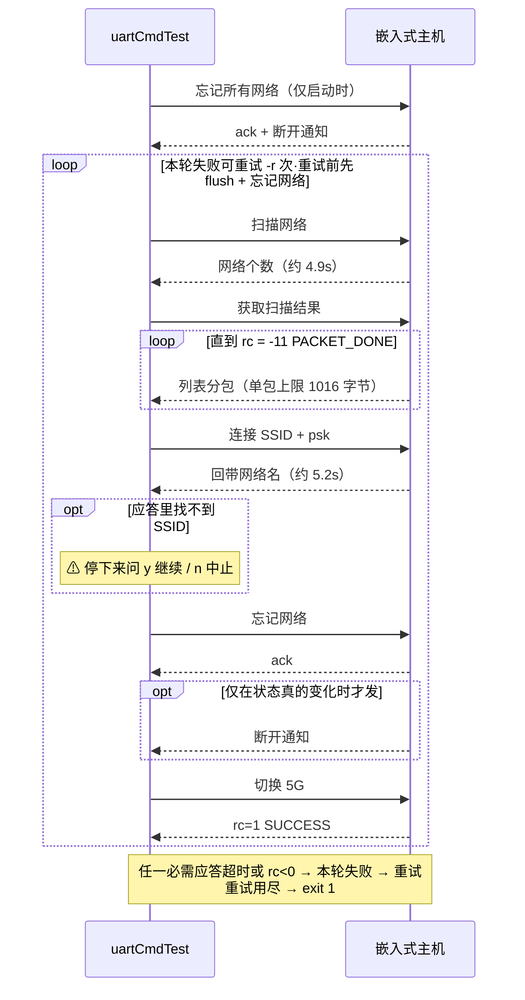

# uartCmdTest — UART 协议测试工具（Python 版）

通过串口测试嵌入式主机功能。两种模式：

- **测试集模式**：跑一组可增删的测试。支持循环老化、失败重试、依赖跳过、
  测试隔离、时延断言、JSON/JUnit 报告
- **指令模式**：从指令表里选，或手输十六进制，单条发送并看应答

工具自身有回归测试（`python3 -m unittest discover`，不需要接设备）。

> C 版在 `linux_c-programe/uartCmdTest/`，是封测版本已冻结。
> **以 Python 版为准**，改动不再同步到 C 版。

协议细节见 C 版目录下的 `Uart command.md`。

---

## 安装

```bash
sudo apt install python3-serial          # 树莓派推荐，避开 PEP 668
# 或者用 venv:
# python3 -m venv venv && venv/bin/pip install pyserial
```

树莓派上直接 `pip install pyserial` 会报 `externally-managed-environment`
（PEP 668），用上面两种方式之一。

串口权限：

```bash
sudo usermod -a -G dialout $(whoami)     # 加组后需重新登录
```

## 快速开始

```bash
# 1. 先看有哪些测试（不需要接设备）
python3 uart_stress_test.py --list-tests

# 2. 只跑只读查询，验证串口通了。最安全，不需要 -s/-w
#    不给 --role/--topology 会先提示选被测设备的角色
python3 uart_stress_test.py -p /dev/ttyUSB0 --tags query -c 1

# 3. WiFi 老化循环（默认组）。Rx + 一对一 = Rx 开热点、同时连路由
python3 uart_stress_test.py -p /dev/ttyUSB0 --role rx --topology 1to1 \
    -s "Actmicro-wifi" -w "actionsuser"

# 4. 长跑统计偶发失败率。Tx + 一对多 = Tx 开 softap、同时连路由
python3 uart_stress_test.py -p /dev/ttyUSB0 --role tx --topology 1tomany \
    -s "Actmicro-wifi" -w "actionsuser" -c 500 -r 3

# 5. 手发十六进制调协议（指令模式不需要角色）
python3 uart_stress_test.py -p /dev/ttyUSB0 -i
```

完整帮助：`python3 uart_stress_test.py -h`

## 用法速查

### 按分类跑

```bash
--tags query              # 只读查询，最安全，不需要 -s/-w
--tags display            # 旋转/缩放/HDMI/HDCP
--tags audio,net          # 多个 tag 取并集
--tags core -c 500 -r 3   # WiFi 老化长跑
--tags remote             # Remote 指令，需先和对端配对
--tags danger             # !! 会改配置或重启设备
--tags logmode            # !! 开 log 后设备不再回应任何命令
```

被选中的测试如果依赖了别的测试，依赖会自动带上，不用手动列。

`--tags` 选完之后还会再按**角色**筛一遍：不适用于当前 `--role`/`--topology`
的测试直接不跑，见[被测设备的角色](#被测设备的角色)。

### 什么时候需要 `-s` / `-w`

只有**真会用到凭据**的测试才要求，目前是「连接网络」一条。所以：

```bash
--tags query      # 不需要
--tags display    # 不需要
--tags core       # 需要（含连接网络）
```

判断依据是测试的 `needs_creds` 标记，不是 tag —— 「查询 WiFi状态」归类上属于
`wifi`，但它是只读查询，不需要任何凭据。

**角色也会影响这个判断**：一台不连路由的设备（一对一的 Tx、一对多的 Rx）
压根不跑「连接网络」，`--tags core` 也不会要求 `-s`/`-w`。

### 循环与重试

```bash
-c 1        # 跑一遍 = 功能验证
-c 500      # 循环 500 遍 = 老化测试
-r 3        # 单轮失败最多重试 3 次；重试前自动清缓冲 + 忘记网络
```

`-c` 作用在**整个测试集**外层，所以这两个维度是正交的：任何 tag 组合都能循环跑。

### 其它常用

```bash
-t 45                     # 设备慢时放宽单命令超时（默认 30s）
-b 9600                   # 非默认波特率
-l run1.log               # 分开保存日志，便于对比多次运行
--report-json run.json    # 输出机器可读报告，见「报告」一节
--report-junit run.xml    # CI 集成
--no-restore              # 跑完不恢复基线，让设备停在被改过的状态便于排查
```

### 退出码

| 码 | 含义 |
|---|---|
| 0 | 全部成功 |
| 1 | 有测试失败，或被用户中止 |
| 130 | Ctrl+C |

可用于 CI 或脚本判断：

```bash
python3 uart_stress_test.py -p /dev/ttyUSB0 --tags query -c 1 || echo "查询测试失败"
```

---

## 文件结构

| 文件 | 职责 |
|------|------|
| `uart_tests.py` | **测试集定义 —— 加/删测试改这里** |
| `uart_exec.py` | 执行机制：测试工厂、依赖跳过、tag 筛选、runner |
| `uart_protocol.py` | 包结构、命令/错误码枚举、编解码、应答解析 |
| `uart_serial.py` | 串口整包收发、超时、缓冲清理 |
| `uart_report.py` | 跨轮次累计，输出 JSON / JUnit |
| `uart_commands.py` | 指令模式的指令表 |
| `uart_role.py` | 被测设备角色：Tx/Rx × 拓扑 → 谁开热点、谁连路由 |
| `uart_ui.py` | 日志、配色、hexdump、状态栏、交互确认 |
| `uart_stress_test.py` | CLI、外层循环（cycles / retry） |
| `test_protocol.py` | 协议层回归测试 |
| `test_exec.py` | 执行机制回归测试 |
| `test_role.py` | 角色模型和角色筛选的回归测试 |
| `test_commands.py` | 指令表回归测试（`!!` 标记、交互参数） |
| `test_report.py` | 报告输出回归测试 |

## 工具自身的回归测试

改了协议解析或执行逻辑之后先跑这个。**不需要 pyserial，也不需要接设备**：

```bash
python3 -m unittest discover -v      # 约 0.2 秒
```

期望值不是算出来的，是**设备实际发过的字节**（`Uart command.md` 抓包 +
`test1.log`）。重点覆盖开发时真踩过的坑，每条都对应一次真实 bug：

- 网络个数在 data 偏移 3 而不是 4
- `FF FF` 是有符号 -1（无数据），不是 65535
- 配对状态的值在 rc 之后偏移 1，中间夹了填充字节
- 返回码必须检查 —— 只看包格式会把 `FAILED` / `INCORRECT_PWD` 当成成功
- Command ID 是枚举值的小端序，应答 ID = 请求 `& 0x3FFF | 0x4000`
- 校验和要截断到 16 位，且损坏的包必须被 `Ctx.recv()` 拦下
- 一对一 Rx 开热点、一对多 Tx 开热点，且开热点的一方同时连路由
- 角色排除测试时依赖链要跟着断，且凭据检查要在角色筛选之后

把这三个历史 bug 注回代码验证过，分别有 4 / 10 / 3 个用例失败。
角色和安全相关的守卫也逐条注错验证过（把 `is_ap` 的拓扑判断写反 → 5 条
失败；漏标 `needs_sta` → 2 条；凭据检查忽略角色 → 1 条）。

---

## 加一条测试

编辑 `uart_tests.py`。五种现成工厂 + 自定义函数，按**断言强度**从弱到强：

| 工厂 | 断言了什么 | 收发次数 |
|---|---|---|
| `simple()` | 设备没报错（`rc >= 0`） | 1 |
| `query_int/str/hex()` | 返回值的范围、格式、长度 | 1 |
| `set_and_verify()` | **设置真的生效了**（回读比对） | 2 |
| `set_and_restore()` | 生效了 **+ 跑完恢复原值** | 3~4 |

### 设置类 —— `simple()`，一行

```python
Test("静音 开",   simple(Cmd.AUDIO_MUTE, b"\x01"),   tags=("audio",)),
Test("区域码 CN", simple(Cmd.NET_AP_PARAM, b"\x06\x03"), tags=("net",)),
```

发命令 → 匹配应答 → 检查 `rc >= 0`。

**这只是冒烟测试**：设备回 `rc=SUCCESS` 但功能没生效，它发现不了。
只在**该命令没有查询形式、无法回读**时用（静音、区域码、投屏、
配对、编码参数、系统命令都属于这类）。

### 设置类 —— `set_and_verify()`，验证真的生效

```python
Test("旋转 90度",
     set_and_verify(Cmd.ROTATION, b"\x01", 1, names=ROTATION_ANGLE),
     tags=("display", "rotate")),
Test("缩放 120%",
     set_and_verify(Cmd.SET_OVERSCAN, b"\x78", 120, size=2),
     tags=("display", "zoom")),
```

设置 → 用同一条命令的查询形式（空 data）回读 → 断言值对上。
失败信息带上含义：

```
✗ 旋转 90度: 设置了 1(90度) 但回读是 0(0度)
```

前提是该命令支持查询（`DataLen=FF FF`）。

### 设置类 —— `set_and_restore()`，跑完恢复

```python
# 切到 P2P 会让所有 WiFi station 测试失败，多轮循环时会毒害下一轮
Test("点对点模式 P2P",
     set_and_restore(Cmd.NET_ROLE, b"\x00", 0, names=NET_ROLE_NAME),
     tags=("net", "role")),
```

读原值 → 设置 → 回读断言 → **恢复原值**。用于**状态会外溢影响其它测试**
的情况。断言失败时也会先恢复，不把设备留在半途。

代价是每条 3~4 次收发，所以只在真会外溢时用。目前用在：网络模式、
HDMI 关、HDCP 禁用、log 全关、旋转 270 度。

### 查询类 —— 解析并打印返回值

查询应答的布局是 `rc(2) + [填充] + 值`，光检查 `rc` 会把返回值丢掉，
而返回值往往才是这条查询的意义所在。

**解析参数**：

```python
query_int(cmd, size=1, offset=0, unit="", names=None)
query_str(cmd)
query_hex(cmd)
```

`offset` 是因为有些命令 rc 后面夹了一个填充字节 —— 配对状态的应答是
`00 00 | 00 | 03`，值在偏移 1；而旋转角度是 `00 00 | 03`，值在偏移 0。

`names` 给出"值 → 含义"的映射表，在 `uart_tests.py` 顶部
（`WPS_STATUS`、`PAIRED_DEV_STATUS`、`ROTATION_ANGLE`、`NET_ROLE_NAME`、
`LOG_STATUS`、`ON_OFF`），取自协议文档的枚举表。

**断言参数**（都可选，给了才检查）：

| 参数 | 用于 | 抓什么 |
|---|---|---|
| `allowed=True` | `query_int` | 值必须是 `names` 的键之一 |
| `allowed=(0,1)` | `query_int` | 值必须在给定集合里 |
| `expect=N` | `query_int` / `query_str` | 精确值 |
| `lo=` / `hi=` | `query_int` | 取值范围（闭区间） |
| `pattern=` | `query_str` | 正则卡格式 |
| `min_len=N` | `query_str` / `query_hex` | 最短长度 |
| `expect_len=N` | `query_hex` | payload 精确长度 |

```python
# allowed=True 直接复用 names 的键当合法集合，枚举不用写两遍
Test("查询 旋转角度",
     query_int(Cmd.ROTATION, names=ROTATION_ANGLE, allowed=True), ...)

# 配对状态的值在偏移 1
Test("查询 配对状态",
     query_int(Cmd.PAIRING_CTRL, offset=1, names=WPS_STATUS, allowed=True), ...)

# 2 字节小端 + 范围
Test("查询 缩放比例",
     query_int(Cmd.SET_OVERSCAN, size=2, unit="%", lo=50, hi=300), ...)

# 正则卡格式
Test("查询 Mac地址",  query_str(Cmd.WIFI_MAC_ADDR, pattern=RE_MAC), ...)
Test("查询 Rx版本",   query_str(Cmd.FW_VERSION, pattern=RE_VERSION), ...)
Test("查询 热点密码", query_str(Cmd.AP_PWD, min_len=8), ...)

# 结构还没搞清楚的，直接打十六进制留在日志里
Test("查询 分辨率",   query_hex(Cmd.NATIVE_RESOLUTION), ...)
```

输出效果：

```
✓ 取回值: 120%
✓ 取回值: 3  → 270度
✓ 取回值: 3  → WPS_STATUS_TIMEOUT(配对超时)
✓ 取回: 27243000
✓ 取回: FC:19:28:36:95:69
✓ 取回 4 字节: 00 00 07 80
```

**正则卡格式最能抓到流错位** —— 那种情况下返回值往往还是能解析成
某个字符串，只有形状对不上才暴露：

```
✗ 查询 Mac地址: 取回 '27243000' 不符合格式 '(?:[0-9A-Fa-f]{2}:){5}[0-9A-Fa-f]{2}'
```

Mac 地址位置收到了版本号，正是错位的典型症状。

> **保守设界**：文档没给上下限的（音量、缩放）放宽到只卡明显异常
> （音量 0~100、缩放 50~300）。按猜测收窄会误报。

### 时延上限 —— `max_duration`

```python
Test("连接网络", t_connect, max_duration=20.0, ...)
```

超时算失败。**老化测试里性能退化是真实的失效模式**：设备还在回应、
返回码也对，但连接从 5 秒变成 25 秒 —— 只看通过/失败发现不了。

core 5 条都设了上限，依据是实测延迟留 3 倍余量（`uart_tests.py` 顶部
的 `MAX_SCAN` 等常量）。功能失败优先报功能原因，不被时延盖掉。

比硬上限更敏感的是**退化趋势**，见 [报告](#报告)。

### 要自定义判定的 —— 写个函数

```python
def t_scan(ctx):
    pkt = ctx.step(Cmd.NET_STA_CTRL, bytes([STA_SCAN]))
    ctx.scan_count = network_count(pkt)
    ui.log(f"✓ 扫描完成，发现 {ctx.scan_count} 个网络")
    if ctx.scan_count <= 0:
        raise TestFailed("扫描结果为 0 个网络，无法继续连接")

TESTS = [
    Test("扫描网络", t_scan, tags=("wifi", "core")),
    ...
]
```

**失败就 `raise TestFailed(原因)`**，原因会直接打进日志。

### 为什么测试是函数而不是纯数据表

各条测试的成功判定差异是**逻辑种类**的差异，不是参数的差异：

| 测试 | 判定方式 |
|---|---|
| 切换 5G | 只看 `rc >= 0` |
| 扫描 | `rc >= 0` + 取出个数 + 个数必须 > 0 |
| 获取扫描结果 | 循环收包直到 `PACKET_DONE`，再拼接解析 |
| 连接 | `rc >= 0` + 应答里找到 SSID，找不到只告警不失败 |
| 忘记网络 | `rc >= 0` + 可选的断开通知，缺了只告警 |

硬塞进配置表会长出一套比 Python 本身更难读的自定义语法。所以简单的
80% 用 `simple()` 声明式搞定，难的 20% 写代码。

### `Ctx` 能用什么

| 方法 | 作用 |
|---|---|
| `ctx.step(cmd, data)` | 发命令 → 匹配应答 → 查返回码，失败抛 `TestFailed` |
| `ctx.send(pkt)` | 只发送（要自己拼包时用） |
| `ctx.recv(timeout)` | 收一个包 |
| `ctx.recv_reply(want_id)` | 收匹配的应答，自动跳过异步通知 |
| `ctx.wait_optional(want_id, accept, timeout)` | 等可选包，收不到返回 `None` |
| `ctx.warn(说明)` | 打告警并停下来问，选中止抛 `Aborted` |
| `ctx.forget_all(阶段名)` | 忘记所有网络（清理用） |
| `ctx.ssid` / `ctx.password` | 命令行传进来的 |
| `ctx.networks` / `ctx.scan_count` | 测试之间共享的状态 |

---

## 被测设备的角色

`--role` / `--topology` 决定被测设备在配对里扮演什么，进而决定 **WiFi
相关测试怎么跑**。不给这两个参数，运行时会带说明提示选择。

**配对关系决定谁开热点：**

| 组合 | 开热点 | 连路由 | 说明 |
|---|---|---|---|
| `--role rx --topology 1to1` | 是 | 是 | Tx 连它；它连路由，给自己和 Tx 提供上网/OTA |
| `--role tx --topology 1tomany` | 是 | 是 | 多个 Rx 连它；它连路由，给自己和这些 Rx 提供上网/OTA |
| `--role tx --topology 1to1` | 否 | 否 | 只连 Rx 的热点 |
| `--role rx --topology 1tomany` | 否 | 否 | 只连 Tx 的热点 |

关键规则：**开热点的那一方同时也是 station**，负责连路由，给自己和连上
自己的对端提供上网和 OTA。所以「是不是 AP」和「要不要连路由」是同一个判断
（代码里是 `Setup.is_ap` / `Setup.is_sta`）。

注意**拓扑会翻转角色的身份**：同一台 Tx，一对一时是客户端、一对多时是
热点。所以只问 Tx/Rx 不够，必须连拓扑一起问。

### 为什么必须区分

扫描路由、连接路由、忘记网络这套**只有连路由的那一方做得到**。对一台
一对一的 Tx 跑这四条，结果是全部超时 —— 而超时看起来像设备坏了，
不像参数给错了。

所以这类测试标了前提，不满足时**直接不跑，也不进报告**：

```
按角色（Tx 发送端 / 一对一）排除 4 条:
  - 扫描网络（需要本机连路由）
  - 获取扫描结果（依赖的测试已被角色排除）
  - 连接网络（依赖的测试已被角色排除）
  - 忘记网络（依赖的测试已被角色排除）
本次要跑 1 条测试: 切换到5G
```

**排除而不是跳过**：「这台设备本来就不做这件事」不是缺陷，跳过会让人
以为漏测了。依赖也跟着断 —— 否则下游测试会因为「依赖未通过」被判成
跳过，看起来像出了问题。

三种前提（写在 `uart_tests.py` 的 `Test(...)` 里）：

| 字段 | 含义 | 用在 |
|---|---|---|
| `needs_sta=True` | 需要本机连路由 | 扫描 / 获取结果 / 连接 / 忘记网络 |
| `needs_ap=True` | 需要本机开热点 | 查询和修改热点 SSID / 密码 |
| `roles=("tx",)` | 只在指定角色下有意义 | Tx 专用查询；「查询 Tx版本」限 `rx` |

切频段（`切换到5G`）**故意不卡** —— 那是本机自己的射频设置，两种角色
都做得到。

各角色能跑多少条见 `--list-tests`，它会实时统计而不是写死数字。

### `-s` / `-w` 也跟着角色

凭据检查在**角色筛选之后**才做。一台不连路由的设备压根不跑「连接网络」，
就不会被要求给 `-s`/`-w`：

```bash
# 要求 -s/-w：Rx 会连路由
--role rx --topology 1to1 --tags core   →  ✗ 这些测试需要 -s 和 -w: 连接网络

# 不要求：Tx 一对一不连路由，那几条被排除了
--role tx --topology 1to1 --tags core   →  正常启动
```

这是之前踩过的坑的同一类问题（用 tag 推断凭据需求，导致 `--tags query`
也被索要 `-s`/`-w`），所以有专门的回归测试盯着。

### CI / 非交互

管道或重定向里读不到输入时不会挂住，直接报错并列出四种组合。测试函数
要按角色分叉时读 `ctx.setup`；报告的 `meta` 里也记了 `role` / `topology`。

---

## 依赖与筛选

### `needs` — 依赖

```python
Test("连接网络", t_connect, needs=("获取扫描结果",), tags=("wifi","core")),
```

依赖没通过时本测试**跳过**而不是失败。所以报告长这样：

```
✗ 扫描网络
— 获取扫描结果
— 连接网络
— 忘记网络
✓ 切换到5G
```

一眼看出真正的失败点是"扫描网络"，后三条是被连带的。不这么做的话会
得到一串级联失败，掩盖真因。

`切换到5G` 不依赖扫描，所以照跑 —— 依赖是显式声明的，不是靠列表顺序。

### `tags` — 筛选

```bash
--tags audio          # 只跑音频
--tags wifi,audio     # 多个 tag 取并集
```

被选中的测试如果依赖了没被选中的，**依赖会自动带上**（多层依赖也会递归展开），
否则依赖会被判成"未通过"导致整条链全跳过。

不给 `--tags` 时跑 `uart_tests.DEFAULT_TAGS`，默认是 `["core"]`，
也就是 WiFi 老化主流程（扫描→取结果→连接→忘记→切5G）。

**每组有几条测试以 `--list-tests` 的输出为准**（它从测试集实时统计，
这里写死的数字迟早会和代码脱节）。分组含义：

| tag | 内容 |
|---|---|
| `core` | WiFi 老化主流程（默认跑） |
| `query` | **只读查询，最安全**，随便跑 |
| `display` | 旋转 / 缩放 / HDMI / HDCP / 分辨率 |
| `net` | 模式切换 / 频段 / 区域码 |
| `wifi` | WiFi 相关 |
| `log` | log 状态**查询**（设置在 `logmode`） |
| `remote` | Remote 指令，对端 AM 执行。**需先配对**，否则全超时 |
| `cast` | 投屏 / 配对 |
| `audio` | 静音 / 音量 |
| `encode` | 编码参数 |
| `ota` | 版本检测（真正升级在 `danger`） |
| `tx` | Tx 端专用命令 |
| `sys` | 系统命令 |
| `danger` | **!! 改配置或重启设备** |
| `logmode` | **!! 打开 log 后设备不再回应任何命令** |
| `rotate` `zoom` `hdmi` `hdcp` `role` `region` `band` `pair` `ap` | 更细的子类 |

想只跑安全的：

```bash
python3 uart_stress_test.py -p /dev/ttyUSB0 --tags query -c 1
```

> **`danger` 组会改设备持久配置或重启**（改 SSID/密码、执行升级、
> 恢复出厂、重启）。
>
> **`logmode` 组会打开设备 log，之后所有 UART 命令都会失效** —— 设备被
> log 刷屏后不再回应，整轮测试就地死掉，而且没法靠再发命令救回来（连
> "关闭 log"也发不进去）。log 只在 debug 时手动用，**测试里对 log 只做查询**。
>
> 这两组**都不带任何其它 tag**，所以只有显式 `--tags danger` /
> `--tags logmode` 才会跑到，不会被 `--tags display` 之类误触。
> 同理 `logmode` 也**没有进基线恢复** —— 原来基线里有一条"恢复成 log 全开"，
> 那等于每轮收尾都把命令通道弄死。

---

## WiFi 主流程

默认组（`core`）的流程，全程由应答驱动、**没有任何固定 sleep**：



| 步骤 | 发送 | 期望应答 |
|------|------|----------|
| 扫描网络 | `47 54 00 00 23 82 01 00 00` | 1 包，带网络个数 |
| 获取扫描结果 | `47 54 00 00 23 82 01 00 01` | N 个分包 + `F5 FF` 结束标记 |
| 连接网络 | `47 54 00 00 23 82 3E 00 02 SSID=...` | 回带网络名的确认包 |
| 忘记网络 | `47 54 00 00 23 82 02 00 03 FF` | ack `01 00` + 断开通知 `00 00 06 00 00` |
| 切换到5G | `47 54 00 00 25 88 01 00 02` | `25 48 02 00 01 00`，rc=1 |

### 三条实测踩出来的约束

**1. 必须做应答匹配。** 设备会主动推送不对应任何请求的异步通知（状态变化、
OTA 版本），当成应答收下会让整条流**永久错位** —— 之后每一步都在读上一步的
应答。`recv_reply()` 靠两条判据跳过：Command ID 不匹配，或 ID 相同但内容是
状态通知（`NET_STA_CTRL` 的应答和状态通知共用 `0x4223`，只能靠内容区分）。

**2. 扫描结果分多个包**，单包 data 上限 1016 字节，必须读到 `PACKET_DONE`
为止。少读一个包，残留数据就会被后面的命令误读。

**3. 状态变化通知是可选包。** `00 00 06 00 00` 只有 WiFi 状态真的变了才发，
设备本来没连网络时不会发。当必需包会干等到超时误判失败。

### 启动与重试前的清理

设备如果**已经连在目标网络上**，连接命令不产生状态变化，设备**完全不回应**，
那一轮必然超时失败。所以起跑前和每次重试前都要先"忘记所有网络"—— 不清理的话
重试也是白重试。

重试路径是两步：`flush_input()` 丢掉设备超时后才发的迟到应答 → `forget_all()`
清网络状态。缺一个重试就无效。

---

## 超时预算

| 位置 | 超时 | 理由 |
|------|------|------|
| 每步第一个包 | `-t`，默认 30s | 判断设备是否还活着 |
| 包内字节间隔 | 1s | 115200 下 1024 字节只需 90ms |
| 网络名确认包 | 15s | 实测连接应答要 5.2s，留 3 倍余量 |
| 断开通知包 | 5s | 实测 0.5s 内到 |
| 启动/重试清理 | 5s | 可能本来没连网络，不该干等 |

---

## 命令行参数

| 参数 | 默认 | 说明 |
|------|------|------|
| `-p, --port 设备` | — | 串口号，如 `/dev/ttyUSB0`。除 `--list-tests` 外都要 |
| `-s, --ssid 名称` | — | WiFi SSID。**只有真会连网的测试才需要** |
| `-w, --password 密码` | — | WiFi 密码，跟 `-s` 一起给 |
| `-i, --interactive` | 关 | 指令模式：从指令表选或手输十六进制，只需要 `-p` |
| `-b, --baud 波特率` | 115200 | 可选 9600 / 19200 / 38400 / 57600 |
| `-c, --cycles N` | 100 | 整个测试集循环几遍 |
| `-t, --timeout 秒` | 30 | 等应答第一个字节的超时。设备慢时放宽 |
| `-r, --retry N` | 0 | 单轮失败后最多重试几次。重试前自动清缓冲 + 忘记网络 |
| `-l, --log 文件` | test.log | 日志文件 |
| `--role tx\|rx` | 提示 | 被测设备是发送端还是接收端 |
| `--topology 1to1\|1tomany` | 提示 | 配对拓扑。决定谁开热点 |
| `--tags a,b` | `core` | 只跑带这些 tag 的测试，逗号分隔取并集，依赖自动带上 |
| `--tx-checksum` | 关 | 发送时填真校验和（接收端忽略，仅用于验设备的校验逻辑） |
| `--no-restore` | 关 | 跑完不恢复基线状态 |
| `--report-json 文件` | — | 输出 JSON 报告 |
| `--report-junit 文件` | — | 输出 JUnit XML，CI 可直接展示 |
| `--list-tests` | — | 列出全部测试、依赖关系和 tag 后退出，不需要接设备 |

串口固定 **8 数据位 / 1 停止位 / 无奇偶校验 / 无流控**。

`-h` 会打印带完整示例的帮助。

---

## 报告

```bash
python3 uart_stress_test.py -p /dev/ttyUSB0 -s W -w P -c 500 -r 3 \
    --report-json run.json --report-junit run.xml
```

日志是给人看的，报告是给机器看的。只用标准库生成，不引依赖。
**Ctrl+C 中断也会写报告** —— 长跑靠 Ctrl+C 结束是常规操作。

### JSON

老化测试最关心的两个问题都在里面：

```json
{
  "name": "连接网络", "tags": ["core", "wifi"],
  "pass": 498, "fail": 2, "skip": 0, "pass_rate": 0.996,
  "duration": {
    "min": 4.8, "max": 25.1, "avg": 5.31,
    "drift": { "first_half_avg": 4.9, "second_half_avg": 9.8, "ratio": 2.0 }
  },
  "failures": [ { "cycle": 37, "error": "rc=-8 INCORRECT_PWD(密码错)" } ]
}
```

- **`pass_rate`** —— 跳过的**不计入分母**，它没真跑。500 轮里被跳过 400
  次、实跑 100 次通过 98 次，通过率是 0.98 不是 0.196
- **`failures`** —— 精确到哪一轮、什么原因，不用翻日志
- **`drift`** —— 后半段均值 ÷ 前半段。**退化是渐进的**，跑到 400 轮时
  已经比第 1 轮慢一倍，但每轮都不超时，只有前后对比才看得出来。
  样本 <6 轮时不给结论，那时噪声比信号大

### JUnit XML

每条测试一个 `<testcase>`，**跨轮次聚合**：500 轮里失败 2 次报成一个
`<failure>`，message 说明失败于哪些轮。展开成 500 个 testcase 对 CI
界面没有意义。`classname` 用首个 tag，方便在 CI 里按分类看。

### 终端摘要

```
失败最多的测试:
  ✗ 连接网络: 2/500 轮失败
耗时明显变长的测试:
  ⚠ 连接网络: 前半段 4.9s → 后半段 9.8s（慢了 2.0 倍）
✗ 校验和错误: 3 次（线路质量问题）
```

校验和错误单独报，因为它指向的原因不同 —— 不是固件的逻辑 bug，而是接线、
干扰或波特率。只在真的发生过时才打这一行。

---

## 测试隔离

测试之间会通过设备状态互相污染。两个机制配合，单靠一个覆盖不全：

**`set_and_restore()`** —— 跑完恢复原值。用于**能回读**的状态。
典型的是网络模式：切到 P2P 之后 WiFi station 测试全会失败，多轮循环时
上一轮遗留的状态会毒害下一轮。

**基线恢复** —— 全部跑完后把设备设回已知值。覆盖**没有查询指令、
`set_and_restore` 读不回来**的状态（区域码、频段、投屏）。否则跑完
`--tags net` 设备可能停在日本区、2.4G、P2P 模式上 —— 区域码尤其要紧，
它会改可用信道，影响下一轮的 5G 测试。

基线定义在 `uart_tests.py` 的 `BASELINE`：

```python
BASELINE = [
    ("区域码 中国CN", Cmd.NET_AP_PARAM,    b"\x06\x03"),
    ("频段 5G",       Cmd.SWITCH_WIFI_CHN, bytes([WIFI_CHN_5G])),
    ("三合一模式",    Cmd.NET_ROLE,        b"\x01"),
    ...
]
```

**刻意宽容**：这是收尾清理不是测试。设备已经挂了的时候恢复必然失败，
那不该把已经通过的测试结果变成失败 —— 只打 `⚠` 告警。

`--no-restore` 可以关掉，比如你想让设备保持被改过的状态去排查。

---

## 指令模式

```bash
python3 uart_stress_test.py -p /dev/ttyUSB0 -i
```

```
cmd> l              列出全部指令
cmd> 14             按编号选一条，预填十六进制后可修改
cmd> 47 54 00 ...   直接手输十六进制
cmd> q              退出
```

选编号后进入可编辑状态（`readline` 提供退格、方向键、历史记录）：

```
cmd> 14

  [网络] 扫描网络
  可修改，Enter 发送，Ctrl+C 取消
  hex> 47 54 00 00 23 82 01 00 00
```

十六进制输入很宽松：空格、逗号、冒号、连字符都可省略，大小写均可，
支持 `0x` 前缀，位数必须成对。

### 需要参数的指令

列表里标 `<按提示输入>` 的指令没有固定字节 —— SSID、密码这类东西没有
合理的默认值，所以先问再拼：

```
cmd> 19

  [网络] 连接WiFi
    WiFi 名称 (SSID): Actmicro-wifi
    加密方式:
      1) WPA+SAE   WPA2/WPA3 兼容，实测可用（推荐）
      2) WPA-PSK   仅 WPA2
    选择 [1-2, 默认 1]:
    WiFi 密码: actionsuser
  可修改，Enter 发送，Ctrl+C 取消
  hex> 47 54 00 00 23 82 3E 00 02 53 53 49 44 3D ...
```

问完仍然落到同一个 `hex>` 编辑行，所以**发之前还能看能改**。

目前有三条：`连接WiFi`、`改 热点 SSID`、`改 热点密码`。加密方式默认
`WPA+SAE`（WPA2/WPA3 兼容），这是实测设备接受的写法 —— 即使扫描结果
报的是 `WPA-PSK` 也用它。密码按 WPA 规范卡 8~63 位，SSID 卡 1~32 位，
只收 ASCII（data 是按字节发的，非 ASCII 会让字节数和字符数不一致）。

> 之前这三条在表里写死了示例值（`SSID=L-5G` / `psk=13456789` / `abcd` /
> `12345678`），选中直接就发出去了 —— 结果是连一个不存在的网络，或者
> 把设备热点改成示例值。

指令表在 `uart_commands.py`。那里的十六进制是从命令定义**算出来的**而不是
手写字符串，所以不会和命令码脱节；要问参数的只在表里写一个 handler **名字**，
怎么问放在 `uart_stress_test.py` 的 `ASK_HANDLERS`，表本身保持纯数据。

### `!!` 标记

列表里 `!!` 开头的会改持久配置或让设备失联，包括**开 log 的三条** ——
打开 log 之后设备不再回应任何 UART 命令，连"关闭 log"都发不进去。
`[PL]` 后缀是 Remote 指令，由**对端**执行，没配对时就是超时。

---

## 输出

### 终端

hexdump 样式，右边 ASCII 对照，**每行字节数按终端宽度自适应**（16~64，
取 8 的倍数）：

```
[TX] 47 54 00 00 23 82 3E 00  02 53 53 49 44 3D 41 63 |GT..#.>..SSID=Ac|
     74 6D 69 63 72 6F 2D 77  69 66 69 09 61 75 74 68 |tmicro-wifi.auth|
     65 6E 3D 57 50 41 2B 53  41 45 09 70 73 6B 3D 61 |en=WPA+SAE.psk=a|
```

连接命令和扫描结果本身就是文本，ASCII 列能直接读出 SSID、加密方式、BSSID，
不用手工翻译。想固定行宽就改 `uart_ui.HEX_COLS`（0 = 自适应）。

底部有状态栏（右对齐反显，实时刷新）：

```
                          循环 13 | 成功 12 | 告警 0 | 重试 1
```

配色：

| 标记 | 颜色 | 含义 |
|---|---|---|
| `[TX]` | 青 | 发送 |
| `[RX]` | 黄 | 接收 |
| `✓` | 绿 | 成功 |
| `✗` | 红 | 失败 |
| `⚠` | 亮黄 | 告警 |
| `■` | 洋红 | 用户中止 |
| `—` | | 依赖未通过被跳过 |

状态栏和颜色只在 stdout 是终端时启用，重定向或管道时自动关闭。

### 日志文件

所有收发带毫秒时间戳写入 `test.log`（`-l` 可改），**单行完整十六进制、
不带颜色码**：

```
2026/09/07 14:25:16.745 [TX] 47 54 00 00 23 82 01 00 01
2026/09/07 14:25:16.272 [RX] 47 54 93 F8 23 42 F8 03 00 00 41 63 74 ...
```

刻意保持单行而不是 hexdump —— 排查流错位时这几招最有效，多行会全废掉：

```bash
grep '\[TX\]' test.log | sort -u              # 确认发送的命令是否逐字节相同
grep -o '23 42 .*' test.log | sort | uniq -c  # 统计应答包形态分布
grep '✗' test.log                             # 所有失败
grep '⚠' test.log                             # 所有告警
```

---

## 协议要点

### 包结构

```
Header(2) │ Checksum(2) │ Command ID(2) │ Data Length(2) │ Data(变长)
  47 54   │    00 00    │     23 82     │     01 00      │     00
```

- **Checksum** 发送端默认填 `00 00`（接收端忽略），收到的包**一定校验**，
  详见下一节
- **Command ID** 是固件 `uartCmdID` 枚举值的**小端序**：
  `NET_STA_CTRL = 0x8223` → 线上 `23 82`
- **应答 ID** = 请求 `& 0x3FFF | 0x4000`：`0x8223` → `0x4223`（线上 `23 42`）。
  代码按高字节 `bit7=0 && bit6=1` 通用判定，不给每条命令硬编码
- **Data Length** 是**有符号** short。查询指令用 `FF FF` = **-1** 表示
  "无数据"，不是 65535

这三点由 `struct.Struct("<2sHHh")` 一行表达，不用手工位运算。

### TAG —— 这条命令由谁执行

TAG 不是固定包头，它决定命令走到哪里为止。数值取自 spec 的 `TAG` 表，
**按小端写到线上**。两字母码**按线上字节序读**就是 `(发起者, 执行者)`，
`P` = MCU、`L` = AM：

| 码 | 数值 | 线上 | 含义 |
|----|------|------|------|
| `TG` | `0x5447` | `47 54` | 本地 MCU → **本地 AM**，就地执行 |
| `PL` | `0x4C50` | `50 4C` | 本地 MCU → **对端 AM**，本地 AM 透过 WiFi 转发 |
| `PP` | `0x5050` | `50 50` | 本地 MCU → **对端 MCU**，对端 AM 再下发它的 UART |
| `LP` | `0x504C` | `4C 50` | 对端 AM → 本地 MCU（对端主动发起） |
| `LL` | `0x4C4C` | `4C 4C` | 对端 AM → 本地 AM |
| — | `0xAC57` | `57 AC` | MCU 透传协议，**包结构完全不同**，见下 |

我们（树莓派）扮演 MCU，所以**能发的只有 `TG` / `PL` / `PP`**。`LP` 是
对端 AM 主动发给我们的请求，只解析不构造。

> spec 把 `0x5447` 标成 `TG`（大端读法），和其它四条的线上读法相反。
> **以数值为准，别照字母推字节。**

```python
build(Cmd.ROTATION)                    # 47 54 ... 本地
build(Cmd.ROTATION, tag=Tag.PL)        # 50 4C ... 对端 AM
build_remote(Cmd.ROTATION)             # 同上，语义更直白
build_remote(Cmd.ROTATION, to_mcu=True)  # 50 50 ... 对端 MCU
ctx.remote_step(Cmd.ROTATION)          # 测试里用这个
```

字节和 `Remote_Rx.ptp` / `Remote_Tx.ptp`（doclight 实测用例）逐字节一致，
这两个文件是最硬的参照 —— 它们是真的发出去过的字节，比 spec 表格更可信。

**应答按 `(Command ID, TAG)` 两者匹配**，不是只比 ID。1 对多时对端们的
应答会和本地应答挤在同一条串口上，只比 ID 就会把对端的应答当成本地的 ——
之后每一步都在读上一条的应答。跳过包的日志一定带 TAG：

```
  (跳过异步通知: cmd=0x4823[PL] len=3)
```

认不出的 TAG 直接报错而不是硬解 —— 那说明流已经错位，或者对上了一个
透传帧（它没有 8 字节包头，按命令包解会读出垃圾长度）。

### 校验和

规则（spec 3.2）：**除 checksum 字段本身外，所有字节相加，截断到 16 位**。

```python
def checksum_of(raw):
    return (sum(raw[0:2]) + sum(raw[4:])) & 0xFFFF
```

截断不是可选的 —— 用 `test1.log` 里 382 个真实应答包验证，382/382 吻合，
其中最大和为 `0xFBB8`（扫描列表全是 ASCII 才勉强没溢出，高字节多的包一定会）。

**接收方向恒定校验**。`Ctx.recv()` 先打原始十六进制（损坏的包也要留证据），
再比对校验和，不一致就计数 + 报错并丢弃：

```
[RX] 47 54 21 01 23 42 07 00 00 00 00 1B 00 00 00
✗ 校验和错误: 字段 0x0121 ≠ 重算 0x0122（线路有字节损坏）
```

这一层必须有。上面那个例子只翻了一个数据位，网络个数就从 26 变成 27 ——
不校验的话工具会拿着错数据往下跑，症状伪装成"设备返回了奇怪的值"，极难查。
每轮结束的摘要会报累计的校验和错误数。

**发送方向默认不填**（`00 00`），因为接收端忽略校验和，而 `00 00` 的格式
实测连续 54 个循环通过 —— 没必要拿已验证的通路去换零收益。要填就加
`--tx-checksum`，用来验证设备端的校验逻辑本身：

```bash
# 默认
47 54 00 00 23 82 01 00 00
# --tx-checksum
47 54 41 01 23 82 01 00 00
```

### 返回码

data 前 2 字节是 16 位小端的 `UART_ERR`：

| 值 | 名称 | 说明 |
|----|------|------|
| 2 | `SAME_SETTING` | 设置未变（切到已在的频段会回这个，算成功） |
| 1 | `SUCCESS` | 执行成功 |
| 0 | `VALUE` | 本包携带数据 |
| -1 | `FAILED` | 失败 |
| -2 | `OUT_OF_RANGE` | 超范围 |
| -3 | `INVALID_CMD` | 无效命令 |
| -4 | `TIMEOUT` | 超时 |
| -6 | `BUSY` | 忙 |
| -8 | `INCORRECT_PWD` | 密码错误 |
| -9 | `NOT_SUPPORT` | 不支持 |
| -10 | `CHECK_SUM` | 校验和错误 |
| -11 | `PACKET_DONE` | 分包传输结束（扫描列表末包即此） |

`>= 0` 判为成功。**必须检查返回码** —— 只看"包格式对"会把 `FAILED`、
`INCORRECT_PWD` 当成成功。失败日志会带名字：

```
✗ 连接网络: rc=-8 INCORRECT_PWD(密码错)
```

---

## 常见问题

**`pip install pyserial` 报 externally-managed-environment**
→ PEP 668。用 `sudo apt install python3-serial`，或建 venv。

**`UnicodeEncodeError: 'latin-1' codec can't encode`**
→ 系统 locale 不是 UTF-8。已在代码里用 `sys.stdout.reconfigure()` 处理，
如果还遇到，`export LANG=C.UTF-8` 兜底。

**`Permission denied` 打不开串口**
→ 加入 `dialout` 组后重新登录，或临时用 `sudo`。

**第一轮就超时，连接命令没有任何应答**
→ 设备可能已经连在目标网络上，状态没变化就不回应。启动时会自动清理；
如果仍然如此，用指令模式手发一次"忘记所有网络"确认设备状态。

**长跑中出现单次无响应**
→ 这正是压力测试要找的。用 `-r 3` 让它重试后继续，结束时看
"重试后成功的循环"统计偶发概率。

**终端退出后没有回显 / 最后一行不滚动**
→ 状态栏是上下文管理器，正常退出和 Ctrl+C 都会恢复。若被 `kill -9`
强杀，执行 `reset` 或 `stty sane; printf '\033[r'`。
